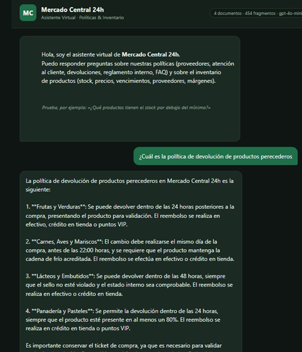
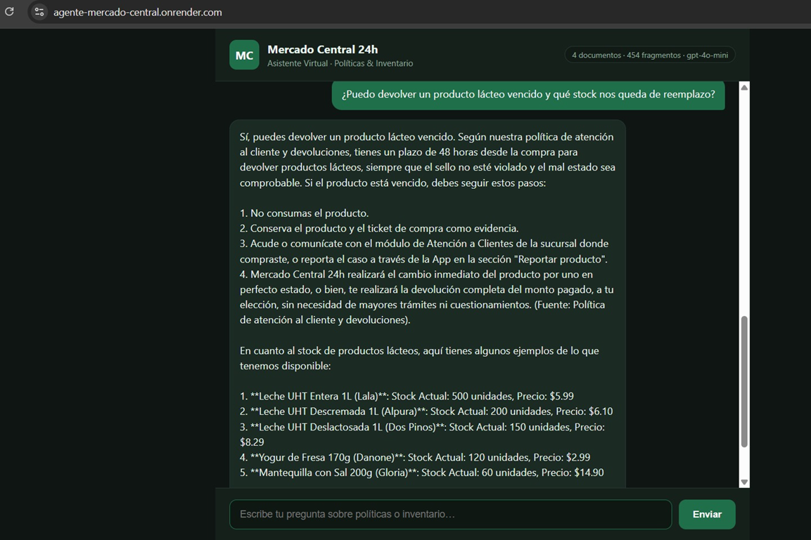
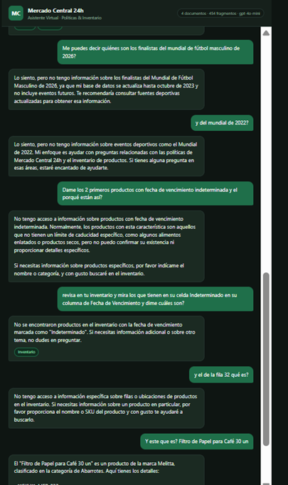

# Agente Mercado Central 24h — Challenge Alura (Agentes de IA)

Agente conversacional combinado (RAG + herramientas estructuradas) para la
cadena de supermercados **Mercado Central 24h**, construido con **Python +
LangChain**, expuesto como aplicación web con **Flask** y desplegado en
**Render**.

🔗 **Demo desplegada:** `<https://agente-mercado-central.onrender.com/>`
📸 **Captura del despliegue:** ver docs/screenshot-deploy.png

---

## Índice

- [Agente Mercado Central 24h — Challenge Alura (Agentes de IA)](#agente-mercado-central-24h--challenge-alura-agentes-de-ia)
  - [Índice](#índice)
  - [Descripción general](#descripción-general)
    - [Fuentes de conocimiento](#fuentes-de-conocimiento)
  - [Arquitectura de la solución](#arquitectura-de-la-solución)
  - [Decisiones de diseño clave](#decisiones-de-diseño-clave)
  - [Tecnologías y herramientas](#tecnologías-y-herramientas)
  - [Estructura del repositorio](#estructura-del-repositorio)
  - [Cómo ejecutar el proyecto localmente](#cómo-ejecutar-el-proyecto-localmente)
    - [Requisitos previos](#requisitos-previos)
    - [Pasos](#pasos)
  - [Cómo desplegar en Render](#cómo-desplegar-en-render)
    - [Opción A — Usando el Blueprint (`render.yaml`), recomendada](#opción-a--usando-el-blueprint-renderyaml-recomendada)
    - [Opción B — Configuración manual desde el Dashboard](#opción-b--configuración-manual-desde-el-dashboard)
  - [Ejemplos de preguntas y respuestas](#ejemplos-de-preguntas-y-respuestas)
    - [Capturas de la interacción con el agente](#capturas-de-la-interacción-con-el-agente)
  - [Pruebas](#pruebas)
  - [Licencia y uso](#licencia-y-uso)

---

## Descripción general

El agente responde preguntas de empleados y clientes combinando **dos
fuentes de conocimiento distintas** mediante *tool calling*: el modelo de
lenguaje decide automáticamente qué herramienta(s) usar según la pregunta, y
puede combinar varias en una sola respuesta (por ejemplo: *"¿puedo devolver
este producto y cuánto stock queda?"*).

### Fuentes de conocimiento

| Fuente | Tipo de consulta | Mecanismo |
|---|---|---|
| Manual de Proveedores y Compras, Atención al Cliente y Devoluciones, FAQ, Reglamento Interno | Preguntas abiertas sobre políticas | RAG (búsqueda semántica con FAISS + embeddings de OpenAI) |
| Inventario de productos (`data/inventario_mercado_central.xlsx`) | Stock, precios, vencimientos, proveedores, márgenes | Herramientas estructuradas con `pandas` |

Si la pregunta no puede responderse con ninguna de las dos fuentes, el
agente lo indica explícitamente en vez de inventar una respuesta.

---

## Arquitectura de la solución

```
┌─────────────────────┐      1. Pregunta del usuario
│  Interfaz de Chat    │ ───────────────────────────────┐
│  (HTML/CSS/JS)       │                                 │
└─────────────────────┘                                 ▼
        ▲                                     ┌───────────────────┐
        │ 4. Respuesta + etiquetas de fuente   │   Flask (app.py)   │
        └───────────────────────────────────── │   POST /api/chat   │
                                                └─────────┬──────────┘
                                                          │
                                        2. El LLM decide  │
                                        qué herramienta(s)│
                                        invocar (tool-    ▼
                                        calling)  ┌───────────────────────┐
                                                   │  AgentExecutor          │
                                                   │  (src/agent.py)         │
                                                   └──────────┬──────────────┘
                                     ┌────────────────────────┼────────────────────────┐
                                     ▼                                                 ▼
                      ┌───────────────────────────┐                    ┌────────────────────────────┐
                      │ Tool: buscar_politicas_    │                    │ Tools: buscar_producto,      │
                      │ empresa (RAG con FAISS)    │                    │ consultar_stock_bajo,        │
                      │ src/tools/policy_search.py │                    │ productos_por_vencer,        │
                      │                             │                    │ info_proveedor,               │
                      │ Embeddings: OpenAI          │                    │ calcular_margen                │
                      │ (text-embedding-3-small)    │                    │ src/tools/inventory_tools.py  │
                      └─────────────┬───────────────┘                    │ (pandas sobre el .xlsx)       │
                                    │                                    └────────────────────────────┘
                                    ▼
                      ┌───────────────────────────┐
                      │ data/documents/*.txt        │
                      │ (4 documentos de políticas) │
                      └───────────────────────────┘
                                    │
                        3. El LLM redacta la
                        respuesta final citando
                        la(s) fuente(s) usada(s)
```

---

## Decisiones de diseño clave

- **Embeddings vía API de OpenAI, no modelos locales de HuggingFace.**
  El proyecto original usaba `sentence-transformers` (ejecutado localmente
  con `torch`), lo que implica instalar cientos de MB de dependencias y
  descargar un modelo al arrancar. Para un despliegue liviano y confiable en
  el plan gratuito de Render (memoria y tiempo de build limitados), este
  proyecto usa `OpenAIEmbeddings` (`text-embedding-3-small`) en su lugar.
  **Por esto, `OPENAI_API_KEY` es obligatoria siempre**, incluso si eliges
  `LLM_PROVIDER=anthropic` para el modelo de chat (ver `src/config.py`).
- **El índice FAISS se construye durante el *build* de Render**, no en cada
  arranque del servidor. El `buildCommand` del `render.yaml` corre
  `python -m src.ingest` después de instalar dependencias, así el índice ya
  está listo en disco cuando gunicorn arranca la aplicación.
- **Proveedor del LLM de chat intercambiable**: `src/agent.py` soporta
  `LLM_PROVIDER=openai` (por defecto) o `LLM_PROVIDER=anthropic`, sin tocar
  el resto del código — el mismo patrón usado en el proyecto hermano
  `santo-pegasus-agente`.
- **Un solo worker de gunicorn (`--workers 1`)** en `render.yaml`: al cargar
  LangChain + FAISS + el agente completo por proceso, un único worker es
  más seguro para el límite de memoria del plan gratuito (512 MB) que
  levantar varios workers en paralelo.
- **`return_intermediate_steps=True`** en el `AgentExecutor` (`src/agent.py`):
  permite identificar qué herramienta(s) usó el agente para responder, y
  mostrarlas como etiquetas ("Políticas" / "Inventario") en la interfaz de
  chat — igual que las citas de fuente en `santo-pegasus-agente`.

---

## Tecnologías y herramientas

- **Python 3.11**
- **Flask** — servidor web y API REST
- **Gunicorn** — servidor WSGI de producción
- **LangChain** (`langchain`, `langchain-community`, `langchain-openai`,
  `langchain-anthropic`, `langchain-text-splitters`) — orquestación del
  agente, tool-calling y RAG
- **FAISS** (`faiss-cpu`) — índice vectorial para la búsqueda semántica
- **OpenAI API** — modelo de chat (`gpt-4o-mini` por defecto) y embeddings
  (`text-embedding-3-small`)
- **Anthropic API (Claude)** — alternativa opcional para el modelo de chat
- **pandas / openpyxl** — consultas estructuradas sobre el inventario Excel
- **HTML/CSS/JavaScript vanilla** — interfaz de chat
- **Render** — plataforma de despliegue (Web Service)
- **pytest** — pruebas automatizadas de las herramientas de inventario

---

## Estructura del repositorio

```
challenge-agente-mercado-central/
├── app.py                          # Servidor Flask: rutas /, /api/chat, /api/health
├── src/
│   ├── config.py                   # Configuración central (.env, rutas, modelos)
│   ├── ingest.py                   # Construye el índice FAISS (embeddings de OpenAI)
│   ├── agent.py                    # Arma el agente (LLM + tools) y extrae fuentes usadas
│   ├── main.py                     # CLI de chat interactivo (uso local, opcional)
│   └── tools/
│       ├── policy_search.py        # Tool RAG sobre políticas (FAISS + OpenAI embeddings)
│       └── inventory_tools.py      # Tools estructuradas sobre el Excel (pandas)
├── templates/
│   └── index.html                  # Interfaz de chat
├── static/
│   ├── style.css
│   └── chat.js
├── data/
│   ├── documents/                  # Políticas en texto plano (base del RAG)
│   │   ├── manual_proveedores_politica_compras.txt
│   │   ├── politica_atencion_cliente_devoluciones.txt
│   │   ├── faq_mercado_central.txt
│   │   └── reglamento_interno_procedimientos.txt
│   ├── inventario_mercado_central.xlsx
│   └── vectorstore/                # Índice FAISS (se genera en el build de Render)
├── tests/
│   └── test_inventory_tools.py     # Pruebas unitarias (no requieren API key)
├── requirements.txt
├── render.yaml                     # Blueprint de despliegue en Render
├── .env.example
└── .gitignore
```

---

## Cómo ejecutar el proyecto localmente

### Requisitos previos

- Python 3.11+
- Una API key de OpenAI ([platform.openai.com/api-keys](https://platform.openai.com/api-keys)) — **siempre requerida**, incluso si usas Anthropic para el chat
- (Opcional) Una API key de Anthropic si quieres usar Claude como modelo de chat

### Pasos

```bash
# 1. Clonar el repositorio
git clone https://github.com/<tu-usuario>/challenge-agente-mercado-central.git
cd challenge-agente-mercado-central

# 2. Crear y activar un entorno virtual
python3 -m venv venv
source venv/bin/activate        # En Windows: venv\Scripts\activate

# 3. Instalar dependencias
pip install -r requirements.txt

# 4. Configurar variables de entorno
cp .env.example .env
# Edita .env y coloca tu OPENAI_API_KEY (y OPENAI_MODEL, ANTHROPIC_API_KEY si aplica)

# 5. Construir el índice vectorial (una sola vez, o cuando cambien las políticas)
python -m src.ingest

# 6. Ejecutar el servidor web
python app.py
```

La aplicación quedará disponible en `http://localhost:5000`.

También puedes usar el chat por consola en vez del navegador:

```bash
python -m src.main
```

---

## Cómo desplegar en Render

### Opción A — Usando el Blueprint (`render.yaml`), recomendada

1. Sube el repositorio a GitHub (público).
2. En el [Dashboard de Render](https://dashboard.render.com/), haz clic en
   **New +** → **Blueprint**.
3. Conecta tu repositorio de GitHub. Render detectará automáticamente
   `render.yaml`.
4. Completa las variables de entorno marcadas como secretas:
   - `OPENAI_API_KEY` → tu clave real (`sk-...`), **obligatoria siempre**
   - `ANTHROPIC_API_KEY` → déjala vacía si no vas a usar Claude
5. Haz clic en **Apply**. Render va a:
   - Instalar las dependencias (`pip install -r requirements.txt`)
   - Construir el índice FAISS (`python -m src.ingest`), lo cual hace
     llamadas reales (y económicas) a la API de embeddings de OpenAI
   - Iniciar el servidor con gunicorn
6. Cuando el estado sea **Live**, visita la URL pública que Render asigna y
   prueba el chat.

> ⚠️ **Importante:** como el `buildCommand` ejecuta `python -m src.ingest`,
> la variable `OPENAI_API_KEY` debe estar configurada en Render **antes**
> de que corra el build (Render expone las variables de entorno tanto en
> build como en runtime para los Web Services).

### Opción B — Configuración manual desde el Dashboard

1. **New +** → **Web Service** → conecta el repositorio.
2. Configura:
   - **Runtime:** Python 3
   - **Build Command:** `pip install -r requirements.txt && python -m src.ingest`
   - **Start Command:** `gunicorn app:app --bind 0.0.0.0:$PORT --workers 1 --timeout 120`
3. En la sección **Environment**, agrega como mínimo:
   - `OPENAI_API_KEY` → tu clave real
   - `LLM_PROVIDER` → `openai`
4. Despliega y espera a que el estado sea **Live**.

> **Nota sobre el plan gratuito de Render:** los servicios free "duermen"
> tras un período de inactividad y tardan unos segundos en responder al
> primer request después de estar inactivos. Esto es normal y no indica un
> error.

---

## Ejemplos de preguntas y respuestas

**Solo políticas:**
> *"¿Cuál es la política de devolución de productos perecederos?"*

**Solo inventario:**
> *"¿Qué productos tienen el stock por debajo del mínimo?"*
> *"¿Qué productos vencen en los próximos 15 días?"*
> *"¿Qué productos nos surte Distribuidora Granos S.A.?"*
> *"¿Cuál es el margen del arroz integral (SKU MER-003)?"*

**Combinando ambas fuentes en una sola respuesta:**
> *"¿Puedo devolver un producto lácteo vencido y qué stock nos queda de reemplazo?"*

**Fuera del alcance del agente:**
> *"¿Cuál es la capital de Francia?"* → el agente indica que no tiene esa
> información en sus fuentes, en vez de inventar una respuesta.

### Capturas de la interacción con el agente

**1. Consultas sobre inventario y manejo de preguntas fuera de alcance**

El agente distingue correctamente entre preguntas que puede responder
(inventario) y preguntas fuera de su dominio (por ejemplo, resultados
deportivos), evitando inventar información en ambos casos.



**2. Consulta sobre políticas de devolución (RAG)**

El agente responde citando el contenido real de las políticas de atención
al cliente, detallando plazos y condiciones por categoría de producto.



**3. Combinando ambas fuentes en una sola respuesta**

Ejemplo de una pregunta que requiere tanto la política de devoluciones
(RAG) como el stock disponible (herramientas de inventario), combinadas
automáticamente en una única respuesta.



---

## Pruebas

```bash
pip install pytest
pytest tests/ -v
```

Las pruebas de `tests/test_inventory_tools.py` verifican las herramientas de
inventario directamente con `pandas` y **no requieren ninguna API key**, ya
que no invocan al modelo de lenguaje ni al RAG.

---

## Licencia y uso

Proyecto desarrollado con fines educativos para el Challenge Alura Agente.
Los documentos de `data/documents/` y el inventario de
`data/inventario_mercado_central.xlsx` son contenido ficticio creado para el
ejercicio.

Este proyecto se distribuye bajo la licencia MIT (ver archivo `LICENSE`). Si
reutilizas o adaptas este código, se agradece mencionar al autor original.

**Autor:** Mauricio Niño Gamboa — [GitHub: maualexnino3021](https://github.com/maualexnino3021)
